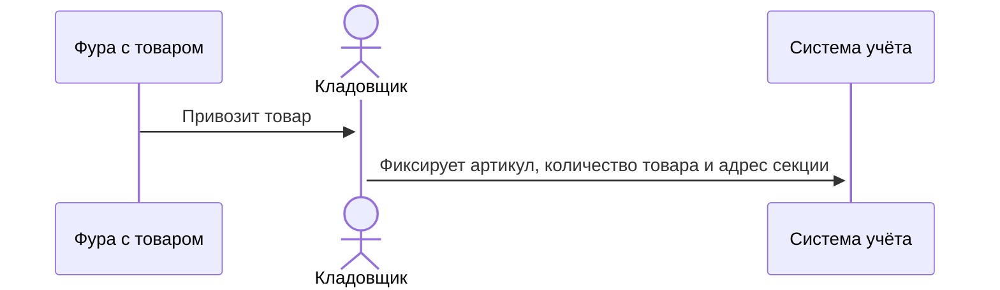
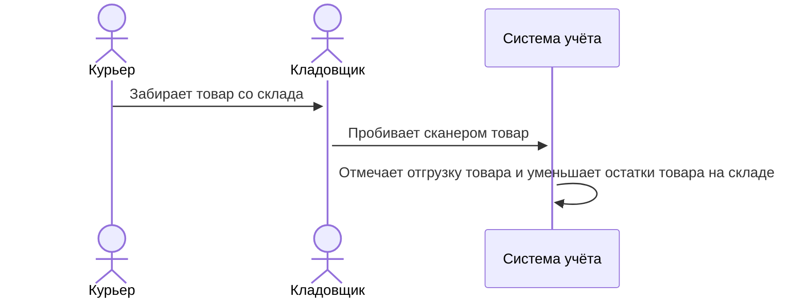
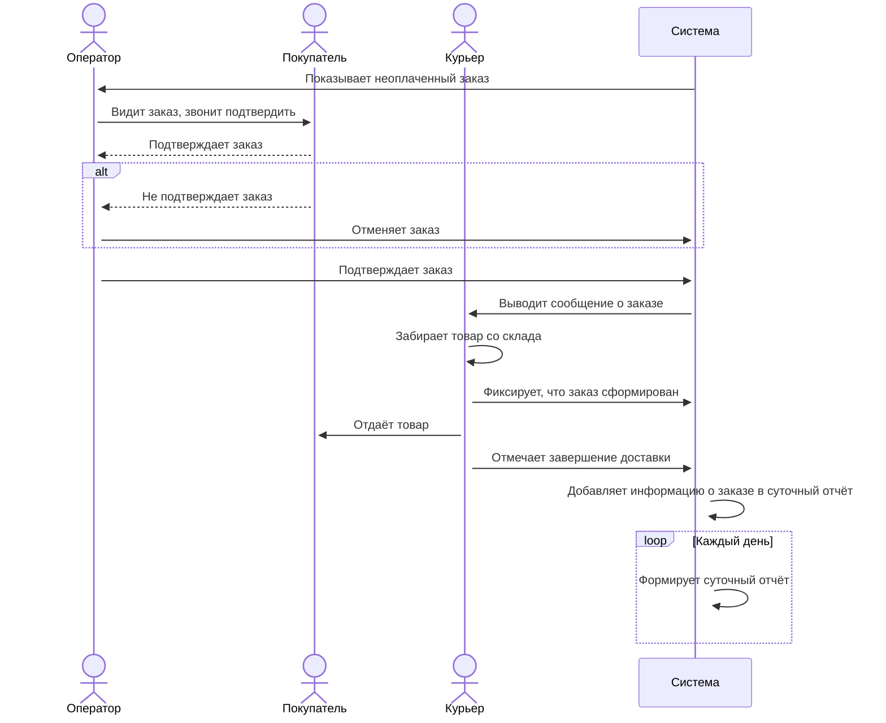

# Описание решение

## Система 1. Управление товарами на складе

> “Ну, это классическая система учета товаров на складе. В ней работает только кладовщик. Есть справочник товарной номенклатуры, есть справочник складских секций - это, грубо говоря, номера стеллажей, где что хранится, есть учет товарных партий с ценами на товары в этой партии - один и тот же товар в разных партиях может иметь разную входную стоимость. Когда приезжает, скажем, фура с товарами, кладовщик принимает его и фиксирует в программе артикул, количество и координаты секции, где будет это храниться. Кладовщик - материально ответственное лицо, ему для доступа в систему выдается специальный ключ такой, на флешку похожий и он за него отвечает. Ну и чтобы попасть в систему - вставляет этот ключ в компьютер. Когда курьер приходит за товаром - кладовщик сканером товар пикает и система сама понимает, что эта единица товара отгружена, остатки уменьшатся. Тут у нас в этой системе самое главное - чтобы данные не потерялись, потому что если в базе что-то смешается или перепутается, мы никогда в жизни этот товар не найдем“.

### Анализ

```
Система учёты товара на складе.
Только одна роль: кладовщик.
Справочники номенклатуры, складских секций (стеллажей).
Есть учёт товарных партий с ценами на товары.
Товар в разных партиях имеет разную стоимость.
Вход в систему происходит через ключ-флешку.
Главное в системе, чтобы данные не потерялись.
```

**Процесс завоза товара на склад:**



**Процесс отгрузки товара со склада:**


	
### Подходящие требования:

2. Система должна позволять позволять пользователю увидеть список имеющихся объектов с возможностью сортировки по названию, цене и секции.
3. После того, как сотрудник получит новую <ФУРУ С ТОВАРАМИ>, система должна позволить зарегистрировать ее с указанием всех обязательных атрибутов.
7. У пользователя должна быть возможность редактировать содержимое справочника для <ТОВАРНЫХ ПАРТИЙ>, при этом все добавляемые значения должны быть уникальны. Если какая-то запись справочника связана с <АРТИКУЛОМ>, то ее должно быть нельзя отредактировать или изменить. 
9. Система должна позволять фиксировать факт выдачи товара курьеру.
16. При выполнении любой операции, связанной с появлением, изменением или удалением объектов в системе должна формироваться запись в журнале аудита. Записи из журнала аудита должно быть невозможно удалить или отредактировать.
25. Система должна по запросу пользователя отображать, в какой <СКЛАДСКОЙ СЕКЦИИ> находится данная единица товара.


## Система 2. Интернет магазин

> “Сам магазин у нас работает на каком-то коробочном решении, мы к нему особо требований не предъявляли, а разработали только модуль для работы со складом: сотрудник с ролью оператор видит заказ, если заказ не оплачен (например, покупатель выбрал оплату курьеру) - связывается с покупателем и подтверждает заказ. После этого курьер идет на склад, получает то что нужно для заказа, отмечает в системе через специальное приложение на планшете, что заказ сформирован и едет на адрес. Курьеры - это наши сотрудники, они тоже все в системе есть. После вручения заказа клиенту также отмечается в мобильном приложении о завершении доставки, а мы в это у себя в отчете за сутки видим.”

### Анализ

```
Модуль для работы со складом, для интернет магазина.
Роли разные, есть оператор и курьер.
Система раз в сутки формирует отчёт.
Курьер на складе отмечает в специальное приложение на планшете.
Курьер у покупателя отмечает доставку в мобильном приложение.
```

**Процесс доставки товара, если товар не оплачен:**



### Подходящие требования:

4. У пользователя в системе должна быть возможность отклонить заявку с указанием причины.
8. Курьер должен иметь возможность в системе подтвердить факт получения товаров на складе.
11. При подтверждении Оператором заказа система должна создать для курьера задание на получение товаров на складе.
13. Пользовательский интерфейс системы должен быть реализован как в web версии, так и в виде <ПРИЛОЖЕНИЯ>.
15. Пользователь с ролью Курьер должен иметь возможность <ДОСТАВКУ ТОВАРА> отметить в мобильном приложении о завершении доставки.
18. Система должна ограничивать доступ к функционалу для пользователей в соответствии с их ролью.
23. Пользователь с ролью <данные повреждены> должен иметь возможность изменить вручную статус у <данные повреждены>. **Оператор или курьер у Заказа**
24. Система должна позволять пользователю фиксировать факт подтверждения <данные повреждены>. **Заказа или доставки заказа**


## Система 3. Управление заданиями

> “По сути это таск трекер, чем-то похож на джиру или сервис менеджер. Сотрудники в нее попадают автоматически при трудоустройстве, как и везде, там регистрироваться не нужно и они в системе все равны. Ну и вход происходит по корпоративной учетке, как у нас с вами. Дальше какие-то другие системы могут назначать задания на сотрудников, это делается через интеграцию, и сотрудник это видит у себя в веб интерфейсе. Там же он может отметить, что выполнил задачу, а может не отмечать - некоторые системы ведут свой жизненный цикл у себя и нам просто присылают обновление, мол, задачу можно закрывать, сотрудник уже что-то где-то отметил. По началу у нас были какие-то проблемы с тем, что часть заданий не доходила до нас, но потом разработчики что-то поменяли и сделали так, что даже если у нас проблемы с доступностью, то после того, как мы снова заработаем, мы сможем получить сигнал о том, что было создано задание для сотрудника и добавим его”

### Анализ

```
Так-трекер, похож на Jira или сервис менеджер.
Сотрудники АВТОМАТИЧЕСКИ попадают после трудоустройства.
В системе ВСЕ равны.
Вход по корпоративной учётке.
Другие системы назначают задания на сотрудника через интеграцию - сотрудник видимей у себя в веб сервисе - может отметить выполнений или не отмечать - системы говорят сотрудник отметил, задачу можно закрыть.
Проблемы с доступностью - решены.
```

### Подходящие требования:

5. Система должна позволять просмотреть список всех находящихся в обработке <ЗАДАНИЙ> с сортировкой по времени их размещения.
10. Система должна позволять пользователю увидеть список всех его заданий.
12. При появлении в системе новых записей временем создания записи должно считаться время появления записи в очереди, а не время фактического добавления записи в базу данных.
14. Система должна обеспечивать интеграцию со смежными системами в синхронном режиме.
19. Система должна позволять пользователю менять статус назначенного на него <ЗАДАНИЯ>.
26. Система должна иметь возможность отображать пользователям список их <ЗАДАЧ> в виде адаптивной верстки для более комфортного просмотра в браузерах мобильных устройств.
